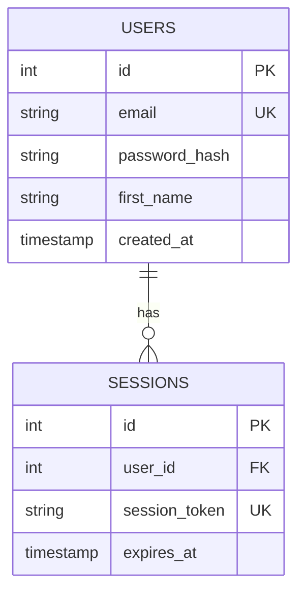

# Sprint 2: Testing, Documentation & Quality - Implementation Plan

**Sprint Duration:** 2 weeks
**Start Date:** November 14, 2025
**Focus Areas:** Database Migration, Testing Infrastructure, Documentation, Code Quality

---

## SPRINT GOALS

1. ✅ Generate and apply database migrations for new schema
2. ✅ Achieve 70%+ test coverage for critical code paths
3. ✅ Create 20+ Storybook component stories with a11y testing
4. ✅ Add comprehensive JSDoc documentation
5. ✅ Consolidate TypeScript configuration

---

## PHASE 1: DATABASE MIGRATION (Day 1)

### Task 1.1: Generate Migration
**Priority:** CRITICAL
**Estimated Time:** 15 minutes

```bash
# Generate migration from schema changes
npm run db:generate
```

**Expected Output:**
- New migration file in `migrations/` directory
- SQL statements for creating `users` and `sessions` tables
- Timestamps in migration filename

**Success Criteria:**
- Migration file created successfully
- No SQL syntax errors
- Contains CREATE TABLE statements for users and sessions
- Foreign key constraints properly defined

---

### Task 1.2: Review Migration File
**Priority:** CRITICAL
**Estimated Time:** 15 minutes

**Review Checklist:**
- [ ] Users table has all 19 fields
- [ ] Sessions table has all 9 fields
- [ ] Foreign key: sessions.userId → users.id with CASCADE delete
- [ ] Unique constraints: users.email, sessions.sessionToken
- [ ] Default values properly set
- [ ] NOT NULL constraints correct
- [ ] Index on users.email
- [ ] Index on sessions.sessionToken

**Actions:**
1. Open generated migration file
2. Verify SQL syntax
3. Check for any Drizzle warnings
4. Confirm rollback statements included

---

### Task 1.3: Apply Migration
**Priority:** CRITICAL
**Estimated Time:** 10 minutes

```bash
# Apply migration to database
npm run db:migrate

# Verify tables created
npm run db:studio
# Open Drizzle Studio and check tables exist
```

**Success Criteria:**
- Migration applied without errors
- Tables visible in Drizzle Studio
- Schema matches expectations
- Can insert test data manually

**Rollback Plan:**
If migration fails:
```bash
# Manually rollback
# Edit migration file to add DOWN migration
# Or restore from backup
```

---

## PHASE 2: TESTING INFRASTRUCTURE (Days 2-3)

### Task 2.1: Create Test Utilities
**Priority:** HIGH
**Estimated Time:** 2 hours

**Files to Create:**

#### `tests/utils/db-test-helpers.ts`
```typescript
/**
 * Database test utilities
 */

import { db } from '@/server/db/DB';
import { users, sessions } from '@/server/db/models/Schema';
import type { NewUser } from '@/server/db/repositories/user.repository';

// Seed test data
export async function seedTestUser(data?: Partial<NewUser>) {
  const testUser = await db.insert(users).values({
    email: data?.email || 'test@example.com',
    passwordHash: 'hashed_password',
    firstName: data?.firstName || 'Test',
    lastName: data?.lastName || 'User',
    authProvider: data?.authProvider || 'local',
    ...data,
  }).returning();

  return testUser[0];
}

// Clean up test data
export async function cleanupTestUsers() {
  await db.delete(sessions);
  await db.delete(users);
}

// Generate test data
export function generateTestUser(overrides?: Partial<NewUser>): NewUser {
  return {
    email: `test-${Date.now()}@example.com`,
    passwordHash: 'hashed_password_123',
    firstName: 'Test',
    lastName: 'User',
    authProvider: 'local',
    isActive: true,
    isEmailVerified: false,
    ...overrides,
  };
}
```

#### `tests/utils/test-factories.ts`
```typescript
/**
 * Test data factories
 */

import { faker } from '@faker-js/faker';
import type { NewUser } from '@/server/db/repositories/user.repository';

export const UserFactory = {
  build: (overrides?: Partial<NewUser>): NewUser => ({
    email: faker.internet.email(),
    passwordHash: faker.internet.password(),
    firstName: faker.person.firstName(),
    lastName: faker.person.lastName(),
    authProvider: 'local',
    isActive: true,
    isEmailVerified: false,
    ...overrides,
  }),

  buildClerkUser: (): NewUser => ({
    email: faker.internet.email(),
    authProvider: 'clerk',
    externalId: `clerk_${faker.string.alphanumeric(20)}`,
    firstName: faker.person.firstName(),
    lastName: faker.person.lastName(),
    isActive: true,
    isEmailVerified: true,
  }),

  buildMultiple: (count: number): NewUser[] => {
    return Array.from({ length: count }, () => UserFactory.build());
  },
};
```

---

### Task 2.2: Unit Tests for User Repository
**Priority:** HIGH
**Estimated Time:** 4 hours

**File:** `src/server/db/repositories/user.repository.test.ts`

**Test Coverage (10 functions = 10 test suites):**

#### 1. findUserByEmail
```typescript
describe('findUserByEmail', () => {
  it('should find user by email', async () => {});
  it('should return null for non-existent email', async () => {});
  it('should exclude soft-deleted users', async () => {});
  it('should be case-sensitive', async () => {});
});
```

#### 2. findUserById
```typescript
describe('findUserById', () => {
  it('should find user by ID', async () => {});
  it('should return null for non-existent ID', async () => {});
  it('should exclude soft-deleted users', async () => {});
});
```

#### 3. findUserByExternalId
```typescript
describe('findUserByExternalId', () => {
  it('should find user by external ID and provider', async () => {});
  it('should return null if provider does not match', async () => {});
  it('should exclude soft-deleted users', async () => {});
});
```

#### 4. createUser
```typescript
describe('createUser', () => {
  it('should create user with all fields', async () => {});
  it('should create user with minimal fields', async () => {});
  it('should fail on duplicate email', async () => {});
  it('should set default values correctly', async () => {});
  it('should set timestamps automatically', async () => {});
});
```

#### 5. updateUser
```typescript
describe('updateUser', () => {
  it('should update user fields', async () => {});
  it('should update timestamps automatically', async () => {});
  it('should not update soft-deleted users', async () => {});
  it('should return null for non-existent user', async () => {});
});
```

#### 6. deleteUser (soft delete)
```typescript
describe('deleteUser', () => {
  it('should soft delete user', async () => {});
  it('should set deletedAt timestamp', async () => {});
  it('should set isActive to false', async () => {});
  it('should return false for non-existent user', async () => {});
  it('should not affect already deleted users', async () => {});
});
```

#### 7. permanentlyDeleteUser
```typescript
describe('permanentlyDeleteUser', () => {
  it('should permanently delete user', async () => {});
  it('should cascade delete sessions', async () => {});
  it('should return false for non-existent user', async () => {});
});
```

#### 8. findAllUsers
```typescript
describe('findAllUsers', () => {
  it('should return paginated users', async () => {});
  it('should exclude soft-deleted by default', async () => {});
  it('should include deleted when requested', async () => {});
  it('should handle empty results', async () => {});
  it('should sort by createdAt desc', async () => {});
  it('should calculate total correctly', async () => {});
});
```

#### 9. updateLastLogin
```typescript
describe('updateLastLogin', () => {
  it('should update lastLoginAt timestamp', async () => {});
  it('should not affect other fields', async () => {});
});
```

#### 10. verifyEmail
```typescript
describe('verifyEmail', () => {
  it('should set email verified flags', async () => {});
  it('should update timestamp', async () => {});
  it('should return updated user', async () => {});
});
```

**Total Tests:** ~40+ individual test cases

**Test Structure:**
```typescript
import { beforeEach, afterEach, describe, it, expect } from 'vitest';
import { cleanupTestUsers, seedTestUser } from '@/tests/utils/db-test-helpers';
import { UserFactory } from '@/tests/utils/test-factories';
import * as userRepo from './user.repository';

describe('User Repository', () => {
  beforeEach(async () => {
    await cleanupTestUsers();
  });

  afterEach(async () => {
    await cleanupTestUsers();
  });

  // Test suites here...
});
```

**Coverage Target:** 95%+

---

### Task 2.3: Unit Tests for Utilities
**Priority:** MEDIUM
**Estimated Time:** 3 hours

#### Test Files to Create:

**1. `src/shared/utils/validation.test.ts`**
- Email validation
- Password strength
- Input sanitization
- Type guards

**2. `src/shared/utils/format.test.ts`**
- Date formatting
- String formatting
- Number formatting

**3. `src/shared/utils/crypto.test.ts`**
- Hash generation
- Token generation
- Encryption/decryption

**Expected Coverage:** 80%+

---

### Task 2.4: Integration Tests
**Priority:** MEDIUM
**Estimated Time:** 4 hours

**File:** `tests/integration/user-repository.spec.ts`

**Test Scenarios:**
- Complete user lifecycle (create → update → login → delete)
- Session management with user
- Multi-user scenarios
- Concurrent operations
- Transaction rollbacks

---

## PHASE 3: STORYBOOK DOCUMENTATION (Days 4-6)

### Task 3.1: UI Component Stories
**Priority:** HIGH
**Estimated Time:** 4 hours

**Files to Create:**

#### `src/client/components/ui/DemoBadge.stories.tsx`
```typescript
import type { Meta, StoryObj } from '@storybook/react';
import { DemoBadge } from './DemoBadge';

const meta: Meta<typeof DemoBadge> = {
  title: 'UI/DemoBadge',
  component: DemoBadge,
  tags: ['autodocs'],
  parameters: {
    layout: 'centered',
  },
};

export default meta;
type Story = StoryObj<typeof meta>;

export const Default: Story = {};

export const WithAccessibility: Story = {
  play: async ({ canvasElement }) => {
    // a11y testing
  },
};
```

**Components to Document (7 stories):**
1. ✅ DemoBadge
2. ✅ DemoBanner
3. ✅ LocaleSwitcher
4. ✅ Sponsors
5. ✅ StructuredData
6. ✅ DemoBanner (variants)
7. ✅ LocaleSwitcher (with locales)

---

### Task 3.2: Form Component Stories
**Priority:** HIGH
**Estimated Time:** 3 hours

**Files to Create:**
1. `src/client/components/forms/CounterForm.stories.tsx`
2. `src/client/components/forms/CurrentCount.stories.tsx`
3. `src/client/components/forms/Hello.stories.tsx`

**Test Scenarios per Component:**
- Default state
- Loading state
- Error state
- Success state
- Accessibility testing
- Interaction testing

**Total Stories:** ~12 (4 per component × 3 components)

---

### Task 3.3: Marketing Component Stories
**Priority:** MEDIUM
**Estimated Time:** 6 hours

**Components (11 total):**
1. HeroCentered
2. HeroGradient
3. HeroWithImage
4. FeaturesGrid
5. FeaturesAlternating
6. CtaSimple
7. CtaGradient
8. PricingTable
9. TestimonialsGrid
10. FaqSection
11. Blog components (3 stories)

**Stories per Component:**
- Default variant
- With different content
- Mobile view
- Dark mode (if applicable)
- Accessibility tests

**Total Stories:** ~30+

---

### Task 3.4: Storybook Addons Configuration
**Priority:** LOW
**Estimated Time:** 1 hour

**Configure:**
- @storybook/addon-a11y (accessibility testing)
- @storybook/addon-interactions (interaction testing)
- @storybook/addon-viewport (responsive testing)
- @storybook/addon-docs (auto-documentation)

**File:** `.storybook/main.ts`
```typescript
addons: [
  '@storybook/addon-a11y',
  '@storybook/addon-interactions',
  '@storybook/addon-viewport',
  '@storybook/addon-docs',
],
```

---

## PHASE 4: CODE DOCUMENTATION (Days 7-8)

### Task 4.1: JSDoc for Repository Functions
**Priority:** HIGH
**Estimated Time:** 2 hours

**Enhance:** `src/server/db/repositories/user.repository.ts`

**Template:**
```typescript
/**
 * Find user by email address
 *
 * @param email - User's email address (case-sensitive)
 * @returns User object if found, null otherwise
 *
 * @remarks
 * - Excludes soft-deleted users (deletedAt IS NULL)
 * - Email matching is case-sensitive
 *
 * @example
 * ```typescript
 * const user = await findUserByEmail('user@example.com');
 * if (user) {
 *   console.log(user.firstName);
 * }
 * ```
 */
export async function findUserByEmail(email: string): Promise<User | null> {
  // ...
}
```

**Apply to All 10 Functions**

---

### Task 4.2: API Endpoint Documentation
**Priority:** MEDIUM
**Estimated Time:** 3 hours

**File:** `docs/API_REFERENCE.md`

**Structure:**
```markdown
# API Reference

## Authentication Endpoints

### POST /api/auth/signin
Sign in with email and password

**Request:**
```json
{
  "email": "user@example.com",
  "password": "secure_password"
}
```

**Response (200):**
```json
{
  "success": true,
  "data": {
    "token": "...",
    "user": {...}
  }
}
```

**Response (401):**
```json
{
  "success": false,
  "error": {
    "code": "INVALID_CREDENTIALS",
    "message": "Invalid email or password"
  }
}
```

**Rate Limits:**
- 5 requests per minute per IP
- 429 status on rate limit exceeded
```

**Endpoints to Document:**
- POST /api/auth/signin
- POST /api/auth/signup
- POST /api/auth/signout
- GET /api/auth/csrf
- POST /api/auth/validate-password
- POST /api/counter (example endpoint)

---

### Task 4.3: Database Schema Documentation
**Priority:** MEDIUM
**Estimated Time:** 2 hours

**File:** `docs/DATABASE_SCHEMA.md`

**Content:**
- ERD diagram (use Mermaid)
- Table descriptions
- Field descriptions
- Relationships
- Indexes
- Constraints
- Migration history

**Example:**
```markdown
# Database Schema

## Entity Relationship Diagram



## Tables

### users
User accounts and profiles

| Column | Type | Constraints | Description |
|--------|------|-------------|-------------|
| id | serial | PRIMARY KEY | Unique user identifier |
| email | varchar(255) | NOT NULL, UNIQUE | User email address |
| ...
```

---

### Task 4.4: Component Documentation
**Priority:** LOW
**Estimated Time:** 2 hours

**File:** `docs/COMPONENTS.md`

**Content:**
- Component catalog
- Props documentation
- Usage examples
- Best practices
- Accessibility guidelines

---

## PHASE 5: TYPESCRIPT CONFIGURATION (Day 9)

### Task 5.1: Consolidate Path Aliases
**Priority:** MEDIUM
**Estimated Time:** 1 hour

**File:** `tsconfig.json`

**Current (has fallbacks):**
```json
{
  "@/client/*": ["./src/client/*"],
  "@/server/*": ["./src/server/*", "./src/libs/*"],  // Remove fallback
  "@/components/*": ["./src/client/components/*", "./src/components/*"],  // Remove
  "@/libs/*": ["./src/server/lib/*", "./src/libs/*"]  // Remove fallback
}
```

**Target (clean):**
```json
{
  "@/client/*": ["./src/client/*"],
  "@/server/*": ["./src/server/*"],
  "@/shared/*": ["./src/shared/*"],
  "@/middleware/*": ["./src/middleware/*"],
  "@/libs/*": ["./src/libs/*"],
  "@/models/*": ["./src/server/db/models/*"],
  "@/utils/*": ["./src/shared/utils/*"]
}
```

**Actions:**
1. Remove fallback arrays
2. Ensure all imports use correct paths
3. Run type check: `npm run check:types`
4. Fix any broken imports

---

### Task 5.2: Update Import Statements
**Priority:** MEDIUM
**Estimated Time:** 30 minutes

**Search and replace:**
```bash
# Find any remaining old imports
grep -r "@/server/lib" src/
grep -r "@/components/" src/
grep -r "from '@/libs/" src/server/  # Should use @/libs only from libs

# Update manually if found
```

---

## PHASE 6: QUALITY ASSURANCE (Day 10)

### Task 6.1: Run Full Test Suite
**Priority:** CRITICAL
**Estimated Time:** 1 hour

```bash
# Unit tests
npm run test

# Integration tests
npm run test:integration

# E2E tests
npm run test:e2e

# Storybook tests
npm run storybook:test
```

**Success Criteria:**
- All tests passing
- Coverage > 70%
- No flaky tests
- Build successful

---

### Task 6.2: Code Quality Checks
**Priority:** HIGH
**Estimated Time:** 30 minutes

```bash
# Linting
npm run lint

# Type checking
npm run check:types

# Dependency checking
npm run check:deps

# i18n validation
npm run check:i18n

# Build verification
npm run build-local
```

---

### Task 6.3: Coverage Report
**Priority:** MEDIUM
**Estimated Time:** 30 minutes

```bash
# Generate coverage report
npm run test -- --coverage

# Review coverage report
# Identify untested code paths
# Add tests for critical paths < 70%
```

**Coverage Goals:**
- Overall: 70%+
- Repositories: 95%+
- Utilities: 80%+
- Components: 60%+

---

## PHASE 7: DOCUMENTATION UPDATES (Days 11-12)

### Task 7.1: Update README
**Priority:** MEDIUM
**Estimated Time:** 1 hour

**Add Sections:**
- Database schema overview
- Testing instructions
- Storybook usage
- API documentation link

---

### Task 7.2: Update CLAUDE.md
**Priority:** LOW
**Estimated Time:** 30 minutes

**Updates:**
- New database tables
- Repository functions
- Testing commands
- Storybook commands

---

### Task 7.3: Create Migration Guide
**Priority:** LOW
**Estimated Time:** 1 hour

**File:** `docs/MIGRATION_GUIDE.md`

**Content:**
- How to create migrations
- How to apply migrations
- How to rollback migrations
- Best practices
- Troubleshooting

---

## SPRINT 2 CHECKLIST

### Database (Day 1)
- [ ] Generate migration
- [ ] Review migration file
- [ ] Apply migration
- [ ] Verify in Drizzle Studio

### Testing Infrastructure (Days 2-3)
- [ ] Create test utilities (db-helpers, factories)
- [ ] Add 40+ unit tests for user repository
- [ ] Add 15+ tests for shared utilities
- [ ] Add 5+ integration tests

### Storybook (Days 4-6)
- [ ] Configure addons (a11y, interactions)
- [ ] Create 7 UI component stories
- [ ] Create 12 form component stories
- [ ] Create 30+ marketing component stories
- [ ] Add accessibility tests to all stories

### Documentation (Days 7-8)
- [ ] Add JSDoc to 10 repository functions
- [ ] Create API reference (6 endpoints)
- [ ] Create database schema docs
- [ ] Create component documentation

### TypeScript (Day 9)
- [ ] Remove path alias fallbacks
- [ ] Update any broken imports
- [ ] Verify type checking passes

### Quality Assurance (Day 10)
- [ ] Run all test suites
- [ ] Verify 70%+ coverage
- [ ] Run all quality checks
- [ ] Fix any issues found

### Final Documentation (Days 11-12)
- [ ] Update README
- [ ] Update CLAUDE.md
- [ ] Create migration guide
- [ ] Create SPRINT_2_COMPLETED.md summary

---

## SUCCESS METRICS

### Quantitative
- ✅ Test coverage: 70%+ (target: 75%)
- ✅ Storybook stories: 50+ (target: 55)
- ✅ Unit tests: 60+ (target: 65)
- ✅ JSDoc coverage: 100% for repositories
- ✅ All quality checks passing

### Qualitative
- ✅ Comprehensive test utilities
- ✅ Clear API documentation
- ✅ Interactive component catalog
- ✅ Improved developer experience
- ✅ Production-ready codebase

---

## ESTIMATED EFFORT

| Phase | Days | Hours |
|-------|------|-------|
| Database Migration | 1 | 4 |
| Testing Infrastructure | 2 | 16 |
| Storybook | 3 | 24 |
| Documentation | 2 | 16 |
| TypeScript Config | 1 | 8 |
| Quality Assurance | 1 | 8 |
| Final Docs | 1 | 8 |
| **TOTAL** | **10-12 days** | **80-84 hours** |

---

## DEPENDENCIES

**Blockers:**
- None (Sprint 1 completed)

**Prerequisites:**
- Database migration must succeed before repository tests
- Test utilities must be created before writing tests
- Storybook must be running for story development

**Nice-to-Have:**
- Seed data for Storybook stories
- Mock API responses for component testing

---

## RISK MITIGATION

**Potential Issues:**

1. **Migration Fails**
   - Mitigation: Review SQL carefully, test on local DB first
   - Fallback: Manual table creation, then generate migration

2. **Low Test Coverage**
   - Mitigation: Focus on critical paths first
   - Fallback: Document untested areas, plan Sprint 3 coverage

3. **Storybook Performance**
   - Mitigation: Lazy load stories, optimize builds
   - Fallback: Reduce story count, focus on critical components

4. **Time Overrun**
   - Mitigation: Prioritize HIGH items, defer LOW items
   - Fallback: Extend sprint or move items to Sprint 3

---

## DELIVERABLES

1. ✅ Database migration files
2. ✅ 60+ unit tests
3. ✅ 50+ Storybook stories
4. ✅ API documentation
5. ✅ Database schema documentation
6. ✅ Component documentation
7. ✅ Consolidated TypeScript config
8. ✅ Sprint completion report

---

## POST-SPRINT REVIEW

**Prepare for Sprint 3:**
- Review coverage gaps
- Identify performance bottlenecks
- Plan Redis integration
- Plan security enhancements
- Gather team feedback

---

Ready to execute! 🚀
