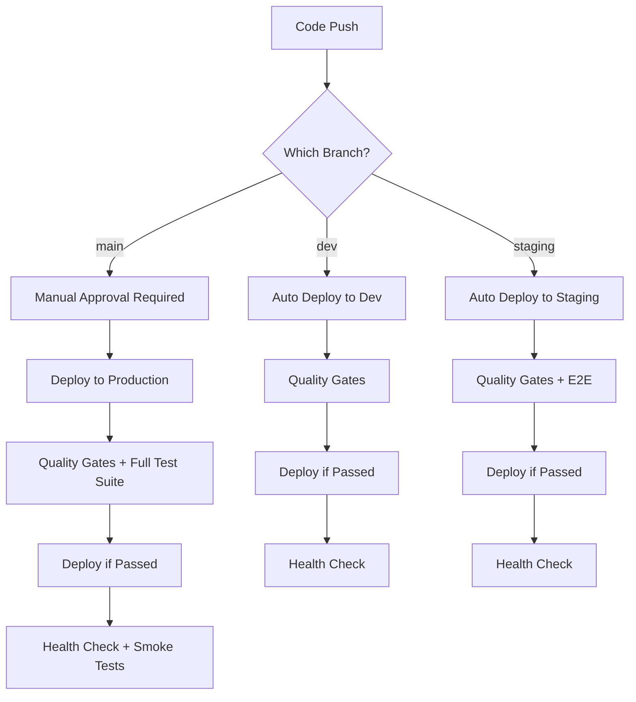

# Complete CI/CD Guide - 2025 Best Practices

This guide documents the complete CI/CD pipeline for the Next.js boilerplate, implementing industry best practices for environment promotion, version control, quality gates, and rollback procedures.

## Table of Contents

- [Overview](#overview)
- [Environment Strategy](#environment-strategy)
- [Deployment Workflow](#deployment-workflow)
- [Version Control](#version-control)
- [Quality Gates](#quality-gates)
- [Rollback Procedures](#rollback-procedures)
- [Monitoring & Verification](#monitoring--verification)
- [Best Practices](#best-practices)
- [Troubleshooting](#troubleshooting)

---

## Overview

### CI/CD Philosophy

Our CI/CD pipeline follows these core principles:

1. **Environment Promotion**: Code flows from dev → staging → production
2. **Version Control**: Every deployment has a unique, traceable version
3. **Quality Gates**: Only code that passes all checks can be deployed
4. **Rollback Ready**: Quick rollback to previous versions when needed
5. **Automated Testing**: Comprehensive testing at every stage
6. **Security First**: Security scanning blocks deployments
7. **Observable**: Full visibility into deployment status and health

### Architecture

```
┌─────────────────────────────────────────────────────────────┐
│                        Git Repository                        │
├──────────────┬──────────────────┬────────────────────────────┤
│   dev branch │  staging branch  │      main branch           │
└──────┬───────┴────────┬─────────┴─────────┬──────────────────┘
       │                │                   │
       ▼                ▼                   ▼
  ┌─────────┐      ┌─────────┐       ┌─────────┐
  │   Dev   │      │ Staging │       │  Prod   │
  │  Env    │─────▶│   Env   │──────▶│  Env    │
  └─────────┘      └─────────┘       └─────────┘
       │                │                   │
       └────────────────┴───────────────────┘
                        │
                  Quality Gates:
                  ✓ Linting
                  ✓ Type Checking
                  ✓ Security Scan
                  ✓ Unit Tests
                  ✓ Integration Tests
                  ✓ E2E Tests (staging/prod)
```

---

## Environment Strategy

### Three-Tier Environment Model

| Environment | Purpose | Git Branch | Auto Deploy | Approval Required | Version Pattern |
|-------------|---------|------------|-------------|-------------------|-----------------|
| **Development** | Feature testing, integration | `dev` | ✅ Yes | ❌ No | `1.0.0-dev.123+abc1234` |
| **Staging** | Pre-production validation | `staging` | ✅ Yes | ❌ No | `1.0.0-rc.5` |
| **Production** | Live user traffic | `main` | ❌ No | ✅ Yes | `1.0.0` |

### Environment Configuration

#### Development Environment
- **Purpose**: Rapid iteration and feature testing
- **Database**: Isolated D1 database (dev instance)
- **Monitoring**: Minimal (errors only)
- **Domain**: `https://environment-dev.1pet.com`
- **Deployment**: Automatic on push to `dev` branch
- **Testing**: Lint, type-check, unit tests
- **Stability**: Can be unstable

#### Staging Environment
- **Purpose**: Production-like validation and QA
- **Database**: Separate D1 database (staging instance)
- **Monitoring**: Full monitoring (Sentry + PostHog + Analytics)
- **Domain**: `https://environment-stage.1pet.com`
- **Deployment**: Automatic on push to `staging` branch
- **Testing**: Full test suite including E2E tests
- **Stability**: Should mirror production

#### Production Environment
- **Purpose**: Live application serving users
- **Database**: Production D1 database
- **Monitoring**: Full monitoring with alerting
- **Domain**: `https://environment.1pet.com`
- **Deployment**: Manual approval required
- **Testing**: Complete test suite + smoke tests
- **Stability**: Must be stable

---

## Deployment Workflow

### Automated Deployment Flow

The environment promotion pipeline (`.github/workflows/environment-promotion.yml`) handles all deployments:



### Deployment Steps

#### 1. **Prepare Phase**
```yaml
Purpose: Determine version and create deployment record
Steps:
  - Calculate semantic version
  - Create GitHub deployment
  - Set deployment status to "in_progress"
Outputs:
  - version: "1.2.3"
  - environment: "production"
  - deployment_id: 12345
```

#### 2. **Quality Gates Phase**
```yaml
Purpose: Ensure code quality and security
Jobs (run in parallel):
  - Linting (ESLint)
  - Type Checking (TypeScript)
  - i18n Validation
  - Security Scanning (pnpm audit + TruffleHog)
  - Dependency Check (OWASP)
Failure: Blocks deployment
```

#### 3. **Testing Phase**
```yaml
Purpose: Validate functionality
Jobs (run in parallel):
  - Unit Tests (Vitest)
  - Integration Tests (with PostgreSQL)
  - E2E Tests (Playwright - staging/prod only)
Coverage Requirements:
  - Unit: Must pass
  - Integration: Must pass
  - E2E: Must pass for production
```

#### 4. **Build Phase**
```yaml
Purpose: Create deployment artifact
Steps:
  - Build Next.js application
  - Inject version into build
  - Upload build artifacts
Artifact Retention: 7 days
```

#### 5. **Deploy Phase**
```yaml
Purpose: Deploy to target environment
Steps:
  - Download build artifacts
  - Apply database migrations
  - Deploy to Cloudflare Pages
  - Tag release (production only)
  - Create GitHub release (production only)
Environment Protection: Requires approval for production
```

#### 6. **Verification Phase**
```yaml
Purpose: Confirm deployment success
Steps:
  - Wait for deployment stabilization (30s)
  - Health check endpoint validation
  - Smoke tests (critical paths)
  - Version verification
Retries: Up to 5 attempts with exponential backoff
```

#### 7. **Notification Phase**
```yaml
Purpose: Alert stakeholders
Actions:
  - Update deployment status
  - Create deployment summary
  - Notify on failure (creates GitHub issue)
  - Log to monitoring systems
```

---

## Version Control

### Semantic Versioning Strategy

We follow [Semantic Versioning 2.0.0](https://semver.org/):

```
MAJOR.MINOR.PATCH[-PRERELEASE][+BUILD]
```

#### Version Patterns by Environment

**Production** (`main` branch):
```
1.2.3
- MAJOR: Breaking changes
- MINOR: New features (backward compatible)
- PATCH: Bug fixes
```

**Staging** (`staging` branch):
```
1.2.3-rc.5
- rc.N: Release candidate number
- Increments with each staging deployment
```

**Development** (`dev` branch):
```
1.2.3-dev.123+abc1234
- dev.N: Development build number
- +hash: Git commit SHA (short)
```

### Version Calculation

Versions are automatically calculated in the deployment workflow:

```bash
# Production version (from git tags)
git describe --tags --abbrev=0

# Staging version (release candidate)
$(git describe --tags --abbrev=0)-rc.${{ github.run_number }}

# Dev version (with commit hash)
$(git describe --tags --abbrev=0)-dev.${{ github.run_number }}+${GITHUB_SHA:0:7}
```

### Manual Version Override

You can deploy a specific version using workflow dispatch:

```bash
# Via GitHub CLI
gh workflow run environment-promotion.yml \
  -f environment=production \
  -f version=1.2.3

# Via GitHub UI
Actions → Environment Promotion Pipeline → Run workflow
  - Environment: production
  - Version: 1.2.3
```

### Version Tracking

Deployed versions are tracked through:

1. **Git Tags**: Every production deployment creates a tag
2. **GitHub Releases**: Production deployments create releases
3. **Version API**: `/api/version` endpoint returns current version
4. **Deployment Records**: GitHub deployment API tracks all deployments

---

## Quality Gates

### Gate Enforcement Strategy

Quality gates are **BLOCKING** - deployments cannot proceed if any gate fails.

```
┌──────────────────────────────────────────────────┐
│                  Code Quality                     │
├──────────────┬──────────────┬────────────────────┤
│   Linting    │ Type Check   │  i18n Validation   │
│   ESLint     │ TypeScript   │  Completeness      │
└──────────────┴──────────────┴────────────────────┘
                       │
                       ▼
┌──────────────────────────────────────────────────┐
│                   Security                        │
├──────────────┬──────────────┬────────────────────┤
│ Dependency   │ Secret Scan  │  OWASP Check       │
│ Audit        │ TruffleHog   │  (Production)      │
└──────────────┴──────────────┴────────────────────┘
                       │
                       ▼
┌──────────────────────────────────────────────────┐
│                   Testing                         │
├──────────────┬──────────────┬────────────────────┤
│ Unit Tests   │ Integration  │  E2E Tests         │
│ Vitest       │ PostgreSQL   │  Playwright        │
└──────────────┴──────────────┴────────────────────┘
                       │
                       ▼
                  Deployment ✅
```

### Quality Gate Details

#### 1. Code Quality Gates

**Linting** (`.github/workflows/environment-promotion.yml:62`)
```yaml
Command: pnpm lint:all
Purpose: Enforce code style and catch common errors
Failure: Blocks deployment
Environment: All
```

**Type Checking** (`.github/workflows/environment-promotion.yml:64`)
```yaml
Command: pnpm --filter web check:types
Purpose: Ensure type safety
Failure: Blocks deployment
Environment: All
```

**i18n Validation** (`.github/workflows/environment-promotion.yml:66`)
```yaml
Command: pnpm --filter web check:i18n
Purpose: Validate translation completeness
Failure: Blocks deployment
Environment: All
```

#### 2. Security Gates

**Dependency Audit** (`.github/workflows/environment-promotion.yml:108`)
```yaml
Command: pnpm audit --audit-level=high
Purpose: Detect vulnerable dependencies
Failure:
  - Production: ❌ Blocks deployment
  - Staging: ⚠️ Warning only
  - Dev: ⚠️ Warning only
```

**Secret Scanning** (`.github/workflows/environment-promotion.yml:111`)
```yaml
Tool: TruffleHog
Purpose: Detect committed secrets
Failure: Blocks deployment
Environment: All
```

**OWASP Dependency Check** (`.github/workflows/environment-promotion.yml:115`)
```yaml
Purpose: Comprehensive dependency security analysis
Failure: Blocks deployment
Environment: Production only
```

#### 3. Testing Gates

**Unit Tests** (`.github/workflows/environment-promotion.yml:150`)
```yaml
Framework: Vitest
Coverage: Reports to Codecov
Failure: Blocks deployment
Environment: All
```

**Integration Tests** (`.github/workflows/environment-promotion.yml:138`)
```yaml
Framework: Vitest + Playwright
Database: PostgreSQL (test instance)
Failure: Blocks deployment
Environment: All
```

**E2E Tests** (Runs in main CI workflow)
```yaml
Framework: Playwright
Browsers: Chromium (local), Chromium + Firefox (CI)
Sharding: 4 shards for parallel execution
Failure: Blocks deployment
Environment: Staging and Production
```

### Skipping Quality Gates (NOT RECOMMENDED)

In emergency situations, you can skip tests:

```bash
gh workflow run environment-promotion.yml \
  -f environment=staging \
  -f skip_tests=true
```

**⚠️ WARNING**: Never skip tests for production deployments.

---

## Rollback Procedures

### Quick Rollback Guide

When you need to rollback a deployment:

1. **Identify the issue** - Confirm rollback is necessary
2. **Determine target version** - Usually the previous version
3. **Trigger rollback workflow**
4. **Verify rollback success**
5. **Document the incident**

### Rollback Workflow

The rollback workflow (`.github/workflows/rollback.yml`) provides automated rollback:

```bash
# Via GitHub CLI
gh workflow run rollback.yml \
  -f environment=production \
  -f target_version=1.2.2 \
  -f reason="Critical bug in payment processing"

# Via GitHub UI
Actions → Rollback Deployment → Run workflow
```

### Rollback Process Flow

```
1. Validate Rollback Request
   ├─ Check environment
   ├─ Verify target version exists
   └─ Find previous successful deployment

2. Create Pre-Rollback Backup
   ├─ Export current D1 database
   ├─ Upload backup artifact
   └─ 30-day retention

3. Perform Rollback
   ├─ Checkout target version
   ├─ Build application (from target version)
   ├─ (Optional) Rollback database migrations
   └─ Deploy to Cloudflare

4. Verify Rollback
   ├─ Health check endpoint
   ├─ Version verification
   └─ Smoke tests

5. Document Incident
   ├─ Create GitHub issue
   ├─ Update deployment status
   └─ Log to monitoring
```

### Rollback Strategies

#### 1. Application Rollback Only (Default)

Rolls back application code but keeps database unchanged.

**Use when:**
- UI/UX issues
- Performance problems
- Non-critical bugs
- New features causing issues

**Command:**
```bash
gh workflow run rollback.yml \
  -f environment=production \
  -f target_version=1.2.2 \
  -f reason="UI regression in checkout flow"
```

#### 2. Application + Database Rollback (DANGEROUS)

Rolls back both application and database migrations.

**Use when:**
- Database schema changes are incompatible
- Data corruption issues
- Migration failures

**⚠️ WARNING**: May cause data loss!

**Command:**
```bash
gh workflow run rollback.yml \
  -f environment=production \
  -f target_version=1.2.2 \
  -f rollback_database=true \
  -f reason="Database migration caused data corruption"
```

**Database Rollback Process:**
1. Pre-rollback backup is created automatically
2. Manual intervention required to restore database
3. Drizzle ORM doesn't support automatic down migrations
4. You must manually write and apply down migrations or restore from backup

### Manual Rollback (Cloudflare Pages)

If the automated workflow fails:

```bash
# List recent deployments
npx wrangler pages deployment list

# Rollback to specific deployment
npx wrangler pages deployment rollback \
  --project-name=next-boilerplate \
  --deployment-id=abc123def456
```

### Rollback Verification

After rollback:

1. **Health Check**: Ensure `/api/health` returns 200
2. **Version Check**: Verify `/api/version` shows correct version
3. **Smoke Tests**: Test critical user paths
4. **Monitor Logs**: Watch for errors in Sentry
5. **Check Metrics**: Confirm error rates decrease

### Rollback Documentation

Every rollback automatically creates a GitHub issue documenting:

- Environment rolled back
- Target version
- Reason for rollback
- Who initiated it
- Success/failure status
- Backup information
- Next steps

---

## Monitoring & Verification

### Deployment Verification

Every deployment includes automated verification:

#### 1. Health Checks

**Endpoint**: `/api/health`

**Response**:
```json
{
  "status": "ok",
  "timestamp": "2025-01-17T12:00:00Z",
  "uptime": 3600,
  "version": "1.2.3",
  "environment": "production",
  "responseTime": "15ms"
}
```

**Verification Logic**:
- 5 retry attempts
- 10-second delay between retries
- Exponential backoff
- Success: HTTP 200 + status: "ok"
- Failure: Any other status code

#### 2. Version Verification

**Endpoint**: `/api/version`

**Response**:
```json
{
  "version": "1.2.3",
  "environment": "production",
  "buildTime": "2025-01-17T11:30:00Z",
  "gitCommit": "abc1234",
  "status": "ok"
}
```

**Verification**: Deployed version matches expected version

#### 3. Smoke Tests

Critical paths tested after production deployment:

```bash
# Homepage
curl -f https://environment.1pet.com/

# Authentication
curl -f https://environment.1pet.com/api/auth/session

# Database connectivity (if enabled in health check)
curl -f https://environment.1pet.com/api/health
```

### Monitoring Stack

Our monitoring strategy uses multiple tools for comprehensive observability:

#### Sentry (Error Tracking)

**Purpose**: Real-time error tracking and performance monitoring

**Configuration**:
```env
NEXT_PUBLIC_ENABLE_SENTRY=true
SENTRY_DSN=https://...@sentry.io/...
```

**Alerts**:
- High-priority: 200% error increase in 5 minutes
- Release regression: New issues affecting 5+ users

**Environment Settings**:
- Dev: Disabled
- Staging: Enabled (testing errors without polluting production)
- Production: Enabled (full monitoring)

#### PostHog (Product Analytics)

**Purpose**: User behavior analytics and feature usage

**Configuration**:
```env
NEXT_PUBLIC_ENABLE_POSTHOG=true
NEXT_PUBLIC_POSTHOG_KEY=phc_...
NEXT_PUBLIC_POSTHOG_HOST=https://...
```

**Dashboards**:
- Activation funnel (visit → signup → first action)
- Feature usage tracking
- User session recordings

**Environment Settings**:
- Dev: Disabled
- Staging: Disabled (avoid polluting production metrics)
- Production: Enabled

#### Cloudflare Analytics

**Purpose**: Edge analytics and performance metrics

**Configuration**:
```env
NEXT_PUBLIC_ENABLE_CF_ANALYTICS=true
NEXT_PUBLIC_CF_ANALYTICS_TOKEN=...
```

**Metrics**:
- Request volume
- Bandwidth usage
- Cache hit rates
- Edge response times
- Geographic distribution

**Environment Settings**:
- Dev: Disabled (token not set)
- Staging: Enabled
- Production: Enabled

#### Better Stack (Logging)

**Purpose**: Centralized logging and log-based alerts

**Configuration**:
```env
NEXT_PUBLIC_BETTER_STACK_SOURCE_TOKEN=...
NEXT_PUBLIC_BETTER_STACK_INGESTING_HOST=...
```

**Alerts**:
- Error logs exceed 20/min
- Rate limiting triggers (Arcjet)
- Database connection failures

**Retention**: 30 days hot storage, 12 months archive

### GitHub Deployment Tracking

Every deployment is tracked in GitHub's deployment API:

**View Deployments**:
```bash
gh api repos/:owner/:repo/deployments?environment=production
```

**Deployment Statuses**:
- `in_progress` - Deployment started
- `success` - Deployment completed and verified
- `failure` - Deployment failed
- `error` - Unexpected error occurred

**Environment URLs**: Each deployment includes the environment URL for quick access

---

## Best Practices

### 1. Environment Promotion Strategy

**Always promote through environments:**
```
dev → staging → production
```

**Never skip staging** for production deployments.

**Testing Requirements by Environment:**

| Test Type | Dev | Staging | Production |
|-----------|-----|---------|------------|
| Lint | ✅ | ✅ | ✅ |
| Type Check | ✅ | ✅ | ✅ |
| Unit Tests | ✅ | ✅ | ✅ |
| Integration Tests | ✅ | ✅ | ✅ |
| E2E Tests | ❌ | ✅ | ✅ |
| Security Scan | ⚠️ | ⚠️ | ✅ |
| Load Testing | ❌ | ✅ (optional) | ✅ (required) |

### 2. Version Management

**Production Releases:**
- Use semantic versioning strictly
- Tag every production deployment
- Create GitHub releases with changelog
- Never reuse version numbers

**Pre-release Versions:**
- Staging: Use `-rc.N` suffix
- Dev: Use `-dev.N+hash` suffix
- Beta: Use `-beta.N` suffix (if applicable)

**Version Bumping:**
```bash
# Patch (bug fixes): 1.2.3 → 1.2.4
# Minor (new features): 1.2.3 → 1.3.0
# Major (breaking changes): 1.2.3 → 2.0.0
```

### 3. Database Migration Strategy

**Best Practices:**
1. **Test migrations in dev first**
2. **Apply to staging before production**
3. **Always create backups before migrations**
4. **Use forward-only migrations** (avoid down migrations)
5. **Make migrations backward-compatible when possible**

**Migration Workflow:**
```bash
# 1. Generate migration
pnpm --filter web db:generate

# 2. Test locally
pnpm --filter web db:migrate

# 3. Deploy to dev (migrations auto-apply)
git push origin dev

# 4. Deploy to staging
git push origin staging

# 5. Deploy to production (with approval)
git push origin main
```

### 4. Security Best Practices

**Secrets Management:**
- ✅ Use GitHub Secrets for sensitive data
- ✅ Rotate secrets quarterly
- ❌ Never commit secrets to git
- ❌ Never log secrets

**Dependency Security:**
- Run `pnpm audit` regularly
- Enable Dependabot alerts
- Review security advisories weekly
- Update dependencies monthly

**Code Security:**
- Enable CodeQL scanning
- Run TruffleHog secret scanning
- Perform security reviews for production deployments
- Use CSP headers and other security headers

### 5. Rollback Preparedness

**Before Deploying:**
- ✅ Know the previous working version
- ✅ Ensure rollback workflow is tested
- ✅ Have monitoring dashboards open
- ✅ Alert team members

**After Deploying:**
- Monitor for 15-30 minutes
- Check error rates in Sentry
- Verify key metrics in PostHog
- Test critical user flows

**Rollback Decision Criteria:**

Rollback **immediately** if:
- Error rate increases by >100%
- Critical functionality is broken
- Security vulnerability is discovered
- Data corruption is detected

Rollback **within 1 hour** if:
- Performance degrades significantly
- Non-critical functionality is broken
- User complaints increase

**Plan forward fix** if:
- Minor UI issues
- Low-impact bugs
- Performance can be optimized

### 6. Communication Best Practices

**During Deployments:**
- Announce in team chat before production deployments
- Share deployment progress and status
- Alert on-call team for major releases

**After Deployments:**
- Share deployment summary
- Highlight new features or changes
- Document known issues (if any)

**During Incidents:**
- Create incident channel immediately
- Share regular status updates
- Document timeline and actions taken
- Conduct post-incident review

### 7. Testing Strategy

**Test Pyramid:**
```
        ┌─────────┐
        │   E2E   │ ← Few, slow, expensive
        ├─────────┤
        │Integration│ ← Some, moderate speed
        ├─────────┤
        │   Unit    │ ← Many, fast, cheap
        └─────────┘
```

**Unit Tests:**
- Fast feedback during development
- Test business logic and utilities
- Mock external dependencies
- Aim for >80% coverage

**Integration Tests:**
- Test database interactions
- Test API endpoints
- Use real database (PostgreSQL test instance)
- Test authentication flows

**E2E Tests:**
- Test critical user paths only
- Run in staging and production deployments
- Use Playwright for cross-browser testing
- Shard tests for parallel execution

---

## Troubleshooting

### Common Issues and Solutions

#### 1. Deployment Stuck in "In Progress"

**Symptoms:**
- Deployment status shows "in_progress" for >30 minutes
- No error messages in logs

**Solutions:**
```bash
# Check workflow status
gh run list --workflow=environment-promotion.yml

# View workflow logs
gh run view <run-id> --log

# Cancel stuck deployment
gh run cancel <run-id>

# Retry deployment
gh workflow run environment-promotion.yml \
  -f environment=staging
```

#### 2. Quality Gate Failures

**Linting Failures:**
```bash
# Fix locally
pnpm --filter web lint:fix

# Commit and push
git add .
git commit -m "fix: resolve linting errors"
git push
```

**Type Errors:**
```bash
# Check types locally
pnpm --filter web check:types

# Fix errors in code
# Re-run type check
```

**Test Failures:**
```bash
# Run tests locally
pnpm --filter web test

# Debug specific test
pnpm --filter web test -- -t "test name"

# Update snapshots if needed
pnpm --filter web test -- -u
```

#### 3. Database Migration Failures

**Symptoms:**
- Migration fails during deployment
- Database schema mismatch errors

**Solutions:**
```bash
# Check migration status
pnpm --filter web db:status

# Verify migration files
ls apps/web/migrations/

# Test migration locally
DATABASE_URL=postgresql://localhost:5432/test \
  pnpm --filter web db:migrate

# If migration is incorrect, fix and regenerate
# Edit schema in src/models/Schema.ts
pnpm --filter web db:generate
```

#### 4. Health Check Failures

**Symptoms:**
- Deployment verification fails
- Health endpoint returns 503 or timeout

**Debug Steps:**
```bash
# 1. Check if deployment succeeded
curl -I https://environment.1pet.com

# 2. Check health endpoint directly
curl -v https://environment.1pet.com/api/health

# 3. Check Cloudflare Pages deployment
npx wrangler pages deployment list

# 4. Check Cloudflare Workers logs
npx wrangler tail
```

**Common Causes:**
- Application failed to build
- Environment variables not set
- Database connection failed
- Cold start timeout

#### 5. Version Mismatch After Deployment

**Symptoms:**
- `/api/version` shows old version
- Deployed version doesn't match expected

**Solutions:**
```bash
# 1. Clear Cloudflare cache
curl -X POST "https://api.cloudflare.com/client/v4/zones/{zone_id}/purge_cache" \
  -H "Authorization: Bearer $CLOUDFLARE_API_TOKEN" \
  -H "Content-Type: application/json" \
  -d '{"purge_everything":true}'

# 2. Force redeploy
gh workflow run environment-promotion.yml \
  -f environment=production \
  -f version=1.2.3

# 3. Check if deployment completed
gh api repos/:owner/:repo/deployments | jq '.[] | select(.environment=="production") | .statuses_url'
```

#### 6. Rollback Failures

**Symptoms:**
- Rollback workflow fails
- Target version deployment fails

**Solutions:**
```bash
# 1. Verify target version exists
git tag -l "v1.2.*"

# 2. Manual rollback using Cloudflare CLI
npx wrangler pages deployment list
npx wrangler pages deployment rollback \
  --project-name=next-boilerplate \
  --deployment-id=<previous-deployment-id>

# 3. Emergency: Deploy specific git tag manually
git checkout v1.2.2
pnpm --filter web build
npx wrangler pages deploy .open-next \
  --project-name=next-boilerplate \
  --branch=main
```

#### 7. Concurrency Issues

**Symptoms:**
- Multiple deployments to same environment
- Deployment queue is stuck

**Solutions:**
```bash
# Cancel all running deployments to environment
gh run list --workflow=environment-promotion.yml --status=in_progress

# Cancel specific runs
gh run cancel <run-id-1>
gh run cancel <run-id-2>

# Wait for concurrency lock to clear (automatic after ~5 minutes)
```

### Emergency Procedures

#### Total Outage

**If production is completely down:**

1. **Immediate Actions** (within 5 minutes):
   ```bash
   # Trigger emergency rollback to last known good version
   gh workflow run rollback.yml \
     -f environment=production \
     -f reason="EMERGENCY: Total outage"
   ```

2. **Parallel Actions**:
   - Create incident channel
   - Alert on-call team
   - Check Cloudflare status
   - Review monitoring dashboards

3. **Communication**:
   - Post status update
   - Notify stakeholders
   - Update status page (if applicable)

#### Database Corruption

**If database data is corrupted:**

1. **Stop all writes**:
   ```bash
   # Deploy maintenance mode or disable writes
   ```

2. **Restore from backup**:
   ```bash
   # Find latest backup
   gh run list --workflow=backup.yml

   # Download backup artifact
   gh run download <run-id>

   # Restore to D1 (manual process - use wrangler D1 console)
   ```

3. **Verify data integrity**:
   ```bash
   # Run data validation queries
   # Check critical records exist
   ```

#### Secrets Compromised

**If secrets are exposed:**

1. **Immediate Rotation**:
   ```bash
   # Rotate all potentially compromised secrets:
   # - CLOUDFLARE_API_TOKEN
   # - DATABASE_URL
   # - Third-party API keys
   ```

2. **Revoke Access**:
   - Revoke old tokens immediately
   - Update GitHub Secrets with new values

3. **Audit**:
   - Review access logs
   - Identify what was accessed
   - Document incident

4. **Prevent Future**:
   - Review secret scanning setup
   - Strengthen access controls
   - Implement secret rotation policy

---

## Appendix

### Workflow Files Reference

| Workflow | Purpose | Trigger | File |
|----------|---------|---------|------|
| Environment Promotion | Main deployment pipeline | Push to dev/staging/main, Manual | `.github/workflows/environment-promotion.yml` |
| Rollback | Rollback to previous version | Manual | `.github/workflows/rollback.yml` |
| CI (Optimized) | Continuous Integration | Push, PR, Merge Queue | `.github/workflows/CI-optimized.yml` |
| Release | Create semantic releases | CI completion on main | `.github/workflows/release.yml` |
| Security Scan | Reusable security scanning | Called by other workflows | `.github/workflows/reusable-security-scan.yml` |
| Cloudflare Deploy | Cloudflare-specific deployment | Push to main, PRs | `.github/workflows/deploy-cloudflare.yml` |

### Environment Variables Reference

| Variable | Purpose | Required | Set In |
|----------|---------|----------|--------|
| `CLOUDFLARE_API_TOKEN` | Cloudflare API access | Yes | GitHub Secrets |
| `CLOUDFLARE_ACCOUNT_ID` | Cloudflare account | Yes | GitHub Secrets |
| `NEXT_PUBLIC_APP_VERSION` | Deployed version | Auto | Build time |
| `NEXT_PUBLIC_ENVIRONMENT` | Environment name | Auto | Build time |
| `DATABASE_URL` | Database connection | Yes (Postgres) | GitHub Secrets |
| `CODECOV_TOKEN` | Code coverage upload | No | GitHub Secrets |
| `SENTRY_DSN` | Error tracking | No | GitHub Secrets |
| `NEXT_PUBLIC_POSTHOG_KEY` | Analytics | No | GitHub Secrets |

### GitHub Environments Setup

To use environment protection rules:

1. Go to **Settings → Environments**
2. Create environments: `dev`, `staging`, `production`
3. Configure protection rules:

**Production Environment:**
- ✅ Required reviewers (1-2 people)
- ✅ Wait timer: 5 minutes
- ✅ Deployment branches: Only `main`

**Staging Environment:**
- ❌ No required reviewers
- ❌ No wait timer
- ✅ Deployment branches: Only `staging`

**Dev Environment:**
- ❌ No protection rules
- ✅ Deployment branches: Only `dev`

### API Endpoints

| Endpoint | Purpose | Response |
|----------|---------|----------|
| `/api/health` | Health check for load balancers | `{ status, uptime, version }` |
| `/api/version` | Version information | `{ version, environment, buildTime, gitCommit }` |

### Useful Commands

```bash
# View all deployments
gh api repos/:owner/:repo/deployments

# View deployment statuses
gh api repos/:owner/:repo/deployments/:deployment_id/statuses

# Trigger deployment
gh workflow run environment-promotion.yml -f environment=staging

# Trigger rollback
gh workflow run rollback.yml \
  -f environment=production \
  -f target_version=1.2.2 \
  -f reason="Bug in payment flow"

# Check workflow runs
gh run list --workflow=environment-promotion.yml --limit 10

# View workflow logs
gh run view <run-id> --log

# Cancel workflow run
gh run cancel <run-id>
```

---

## Summary

This CI/CD pipeline implements enterprise-grade deployment practices:

✅ **Environment Promotion**: Structured dev → staging → production flow
✅ **Version Control**: Semantic versioning with automatic tagging
✅ **Quality Gates**: Comprehensive testing and security scanning
✅ **Automated Rollback**: Quick recovery from failed deployments
✅ **Monitoring**: Full observability with Sentry, PostHog, and Better Stack
✅ **Documentation**: Complete audit trail for all deployments
✅ **Security**: Multiple security scanning layers
✅ **Best Practices**: Following 2025 industry standards

**Key Benefits:**
- 🚀 **Faster Deployments**: Automated testing and deployment
- 🛡️ **Safer Releases**: Quality gates prevent bad deployments
- 🔄 **Quick Recovery**: Automated rollback procedures
- 📊 **Full Visibility**: Comprehensive monitoring and logging
- ✅ **Compliance**: Complete audit trail and version tracking

For questions or issues, please refer to the [troubleshooting section](#troubleshooting) or create an issue in the repository.
