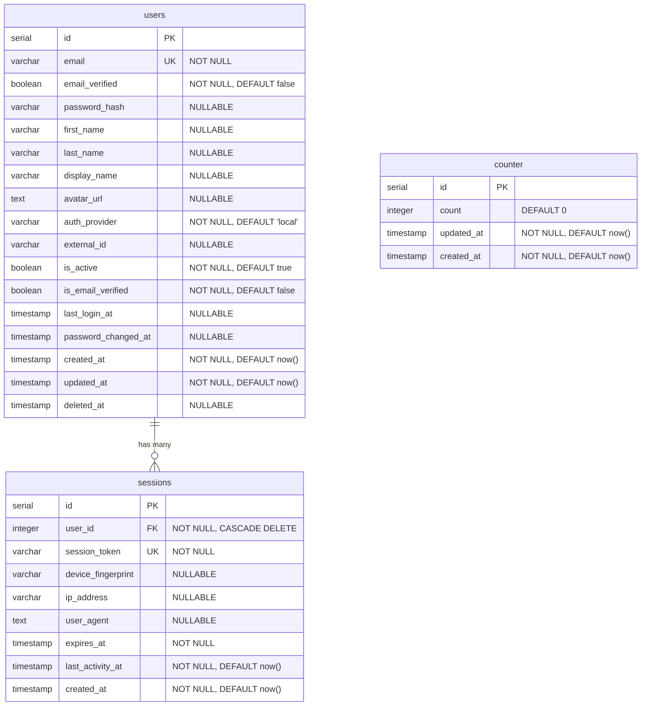

# Database Schema Documentation

This document provides comprehensive documentation for the database schema used in the Next.js Boilerplate project. The schema is defined using Drizzle ORM and uses PostgreSQL as the database engine.

## Table of Contents

1. [Entity Relationship Diagram](#entity-relationship-diagram)
2. [Table Descriptions](#table-descriptions)
3. [Field Documentation](#field-documentation)
4. [Indexes and Constraints](#indexes-and-constraints)
5. [Foreign Keys](#foreign-keys)
6. [Migration History](#migration-history)
7. [Schema Conventions](#schema-conventions)

---

## Entity Relationship Diagram



---

## Table Descriptions

### `users`

**Purpose:** Core table for user authentication and profile management. Supports multiple authentication providers including local (password-based), Clerk, Cloudflare Access, and AWS Cognito.

**Key Features:**
- Multi-provider authentication support
- Soft delete capability
- Email verification tracking
- Security audit fields (last login, password changes)
- Auto-updating timestamps

**Relationships:**
- One-to-many with `sessions` table (a user can have multiple active sessions)

---

### `sessions`

**Purpose:** Manages user authentication sessions with detailed tracking for security and audit purposes.

**Key Features:**
- Session token-based authentication
- Device fingerprinting support
- IP address and user agent tracking
- Automatic session expiration
- Activity monitoring

**Relationships:**
- Many-to-one with `users` table (each session belongs to one user)
- Cascading delete: when a user is deleted, all their sessions are automatically removed

---

### `counter`

**Purpose:** Example/demo table demonstrating basic CRUD operations and auto-updating timestamps.

**Key Features:**
- Simple integer counter
- Auto-updating timestamps
- Used for testing and demonstration purposes

**Relationships:**
- Standalone table with no foreign key relationships

---

## Field Documentation

### Users Table

| Field Name | Type | Constraints | Default | Description |
|------------|------|-------------|---------|-------------|
| `id` | serial | PRIMARY KEY, NOT NULL | auto-increment | Unique identifier for the user |
| `email` | varchar(255) | UNIQUE, NOT NULL | - | User's email address, used for authentication and communication |
| `email_verified` | boolean | NOT NULL | false | Legacy field for email verification status |
| `password_hash` | varchar(255) | NULLABLE | null | Hashed password for local authentication; null for OAuth users |
| `first_name` | varchar(100) | NULLABLE | null | User's first name |
| `last_name` | varchar(100) | NULLABLE | null | User's last name |
| `display_name` | varchar(200) | NULLABLE | null | Public display name shown in UI |
| `avatar_url` | text | NULLABLE | null | URL to user's avatar/profile picture |
| `auth_provider` | varchar(50) | NOT NULL | 'local' | Authentication provider: 'local', 'clerk', 'cloudflare', 'cognito' |
| `external_id` | varchar(255) | NULLABLE | null | User ID from external authentication provider |
| `is_active` | boolean | NOT NULL | true | Account status flag; false for suspended/deactivated accounts |
| `is_email_verified` | boolean | NOT NULL | false | Current email verification status |
| `last_login_at` | timestamp | NULLABLE | null | Timestamp of user's most recent login |
| `password_changed_at` | timestamp | NULLABLE | null | Timestamp of last password change |
| `created_at` | timestamp | NOT NULL | now() | Account creation timestamp |
| `updated_at` | timestamp | NOT NULL | now() | Last update timestamp, auto-updates on modification |
| `deleted_at` | timestamp | NULLABLE | null | Soft delete timestamp; null for active accounts |

---

### Sessions Table

| Field Name | Type | Constraints | Default | Description |
|------------|------|-------------|---------|-------------|
| `id` | serial | PRIMARY KEY, NOT NULL | auto-increment | Unique identifier for the session |
| `user_id` | integer | FOREIGN KEY, NOT NULL | - | Reference to users table, CASCADE on delete |
| `session_token` | varchar(255) | UNIQUE, NOT NULL | - | Unique token for session identification and validation |
| `device_fingerprint` | varchar(255) | NULLABLE | null | Browser/device fingerprint for security tracking |
| `ip_address` | varchar(45) | NULLABLE | null | Client IP address (IPv6 compatible) |
| `user_agent` | text | NULLABLE | null | Browser user agent string |
| `expires_at` | timestamp | NOT NULL | - | Session expiration timestamp |
| `last_activity_at` | timestamp | NOT NULL | now() | Timestamp of last session activity |
| `created_at` | timestamp | NOT NULL | now() | Session creation timestamp |

---

### Counter Table

| Field Name | Type | Constraints | Default | Description |
|------------|------|-------------|---------|-------------|
| `id` | serial | PRIMARY KEY, NOT NULL | auto-increment | Unique identifier for the counter record |
| `count` | integer | NULLABLE | 0 | Counter value |
| `updated_at` | timestamp | NOT NULL | now() | Last update timestamp, auto-updates on modification |
| `created_at` | timestamp | NOT NULL | now() | Record creation timestamp |

---

## Indexes and Constraints

### Primary Keys

All tables use auto-incrementing serial integer primary keys:
- `users.id`
- `sessions.id`
- `counter.id`

### Unique Constraints

| Table | Column | Constraint Name | Purpose |
|-------|--------|-----------------|---------|
| `users` | `email` | `users_email_unique` | Ensures each email address is registered only once |
| `sessions` | `session_token` | `sessions_session_token_unique` | Ensures each session token is unique for security |

### Indexes

The unique constraints automatically create B-tree indexes:
- **`users_email_unique`**: Index on `users.email` for fast lookup during login
- **`sessions_session_token_unique`**: Index on `sessions.session_token` for fast session validation

**Performance Notes:**
- Email lookups during authentication are O(log n) due to the unique index
- Session token validation is highly optimized with the unique index
- Consider adding composite indexes for common query patterns (e.g., `user_id + expires_at` for active session queries)

---

## Foreign Keys

### sessions → users

| Constraint Name | From Column | To Table | To Column | On Delete | On Update |
|----------------|-------------|----------|-----------|-----------|-----------|
| `sessions_user_id_users_id_fk` | `sessions.user_id` | `users` | `id` | CASCADE | NO ACTION |

**Behavior:**
- **CASCADE DELETE**: When a user is deleted, all their sessions are automatically deleted
- **NO ACTION UPDATE**: User ID updates are not cascaded (user IDs should not change)

**Rationale:**
- Cascade delete ensures no orphaned sessions remain after user deletion
- Maintains referential integrity between users and sessions
- Simplifies cleanup operations

---

## Migration History

### Migration 0000: `init-db.sql`

**Date:** Initial migration
**Purpose:** Bootstrap database with demo counter table

**Changes:**
- Created `counter` table with:
  - Primary key `id`
  - Integer `count` field with default value 0
  - Timestamps: `created_at`, `updated_at`

**Files:**
- `/migrations/0000_init-db.sql`
- `/src/server/db/migrations/0000_init-db.sql`

---

### Migration 0001: `rapid_sharon_carter.sql`

**Date:** Second migration
**Purpose:** Implement user authentication and session management

**Changes:**
1. **Created `users` table** with:
   - Authentication fields (email, password_hash)
   - Profile fields (first_name, last_name, display_name, avatar_url)
   - Multi-provider support (auth_provider, external_id)
   - Security fields (last_login_at, password_changed_at)
   - Account status (is_active, is_email_verified)
   - Soft delete support (deleted_at)
   - Auto-updating timestamps

2. **Created `sessions` table** with:
   - Session identification (session_token)
   - User relationship (user_id foreign key)
   - Security tracking (device_fingerprint, ip_address, user_agent)
   - Session lifecycle (expires_at, last_activity_at)
   - Timestamps

3. **Added foreign key constraint:**
   - `sessions.user_id` → `users.id` with CASCADE delete

**Files:**
- `/migrations/0001_rapid_sharon_carter.sql`

---

## Schema Conventions

### Naming Conventions

**Tables:**
- Lowercase, plural nouns (e.g., `users`, `sessions`)
- Snake_case for multi-word names

**Columns:**
- Snake_case for all column names (e.g., `first_name`, `email_verified`)
- Clear, descriptive names that indicate purpose
- Boolean fields prefixed with `is_` (e.g., `is_active`, `is_email_verified`)

**Constraints:**
- Format: `{table}_{column}_{type}`
- Examples: `users_email_unique`, `sessions_user_id_users_id_fk`

---

### Timestamp Fields

All tables follow a consistent timestamp pattern:

| Field | Type | Purpose | Default | Auto-Update |
|-------|------|---------|---------|-------------|
| `created_at` | timestamp | Record creation time | now() | No |
| `updated_at` | timestamp | Last modification time | now() | Yes |
| `deleted_at` | timestamp | Soft delete time | null | Manual |

**Implementation Details:**
- `created_at`: Set once on record creation via `defaultNow()`
- `updated_at`: Automatically updated on any record modification via `.$onUpdate(() => new Date())`
- `deleted_at`: Nullable field for soft delete pattern (null = active, timestamp = deleted)

---

### Soft Delete Pattern

The schema implements a soft delete pattern on the `users` table:

**How it works:**
- Active records: `deleted_at IS NULL`
- Deleted records: `deleted_at IS NOT NULL`
- Deleted records remain in database for audit/recovery purposes

**Query patterns:**
```sql
-- Active users only
SELECT * FROM users WHERE deleted_at IS NULL;

-- Soft delete a user
UPDATE users SET deleted_at = now() WHERE id = ?;

-- Restore a user
UPDATE users SET deleted_at = NULL WHERE id = ?;

-- Hard delete (permanent)
DELETE FROM users WHERE id = ? AND deleted_at IS NOT NULL;
```

**Benefits:**
- Preserves historical data
- Enables user account recovery
- Maintains audit trail
- Prevents accidental data loss

---

### Auto-Updating Timestamps

The `updated_at` field uses Drizzle ORM's `$onUpdate()` modifier:

```typescript
updatedAt: timestamp('updated_at', { mode: 'date' })
  .defaultNow()
  .$onUpdate(() => new Date())
  .notNull()
```

**Behavior:**
- Automatically updates to current timestamp on any UPDATE operation
- No manual intervention required
- Ensures accurate modification tracking

---

### Multi-Provider Authentication

The schema supports multiple authentication providers through the `auth_provider` field:

| Provider | Value | external_id Usage | password_hash Usage |
|----------|-------|-------------------|---------------------|
| Local | `'local'` | null | Required (hashed) |
| Clerk | `'clerk'` | Clerk user ID | null |
| Cloudflare | `'cloudflare'` | Cloudflare user ID | null |
| AWS Cognito | `'cognito'` | Cognito user ID | null |

**Design Rationale:**
- Single unified user table for all auth providers
- `external_id` links to provider's user ID
- `password_hash` only used for local authentication
- Enables seamless provider switching and migration

---

### Security Considerations

**Password Storage:**
- Passwords are never stored in plain text
- `password_hash` field stores bcrypt/argon2 hashes
- Field is nullable to support OAuth-only users

**Session Security:**
- Session tokens should be cryptographically random
- `expires_at` enforces time-limited sessions
- `device_fingerprint` helps detect session hijacking
- IP address and user agent tracking for audit logs

**Email Verification:**
- Dual fields: `email_verified` (legacy) and `is_email_verified` (current)
- Consider requiring verification before account activation

**Soft Delete:**
- Protects against accidental deletion
- Maintains compliance with data retention policies
- Consider adding hard delete after retention period

---

## Schema Modification Workflow

To modify the database schema:

1. **Edit the schema file:**
   ```bash
   # Edit: src/server/db/models/Schema.ts
   ```

2. **Generate migration:**
   ```bash
   npm run db:generate
   ```
   This creates a new migration file in `/migrations/`

3. **Apply migration:**
   - **Automatic:** Restart Next.js dev server (via `instrumentation.ts`)
   - **Manual:** Run `npm run db:migrate`

4. **Update documentation:**
   - Update this file to reflect schema changes
   - Document new fields, relationships, and constraints

5. **Test changes:**
   ```bash
   npm run test           # Unit tests
   npm run test:e2e       # E2E tests
   npm run db:studio      # Visual verification
   ```

---

## Database Tools

### Drizzle Studio

Visual database browser and editor:

```bash
npm run db:studio
```

Access at: https://local.drizzle.studio

**Features:**
- Browse tables and data
- Execute queries
- Manage relationships
- View schema structure

### Migration Commands

```bash
# Generate new migration from schema changes
npm run db:generate

# Apply pending migrations
npm run db:migrate

# View migration status
npm run db:status
```

---

## Related Documentation

- **Schema Definition:** `/src/server/db/models/Schema.ts`
- **Database Connection:** `/src/utils/DBConnection.ts`
- **Database Utilities:** `/src/libs/DB.ts`
- **Migrations Directory:** `/migrations/`
- **Architecture:** `/docs/ARCHITECTURE.md`
- **Security:** `/docs/SECURITY.md`

---

## Additional Notes

### Local Development

The project uses **PGlite** for local development:
- No Docker or PostgreSQL installation required
- In-memory database with full PostgreSQL compatibility
- Automatic schema creation on startup

### Production Deployment

Production requires a real PostgreSQL database:
- Set `DATABASE_URL` environment variable
- Migrations run automatically during build
- Recommended provider: Prisma Postgres

### Performance Optimization

Consider these optimizations for production:

1. **Add composite indexes** for common queries:
   ```sql
   CREATE INDEX idx_active_sessions ON sessions(user_id, expires_at)
   WHERE expires_at > now();
   ```

2. **Partition large tables** by date:
   ```sql
   -- Partition sessions table by month
   CREATE TABLE sessions_2025_01 PARTITION OF sessions
   FOR VALUES FROM ('2025-01-01') TO ('2025-02-01');
   ```

3. **Archive old sessions**:
   - Implement automatic cleanup of expired sessions
   - Archive to separate table for audit purposes

4. **Add database-level constraints**:
   ```sql
   -- Ensure expires_at is in the future
   ALTER TABLE sessions ADD CONSTRAINT check_expires_future
   CHECK (expires_at > created_at);
   ```

---

## Version History

| Version | Date | Changes | Migration |
|---------|------|---------|-----------|
| 1.0 | Initial | Counter table | 0000_init-db |
| 2.0 | Latest | Users and sessions tables | 0001_rapid_sharon_carter |

---

**Last Updated:** 2025-11-14
**Schema Version:** 2.0
**Database Engine:** PostgreSQL (PGlite in development)
